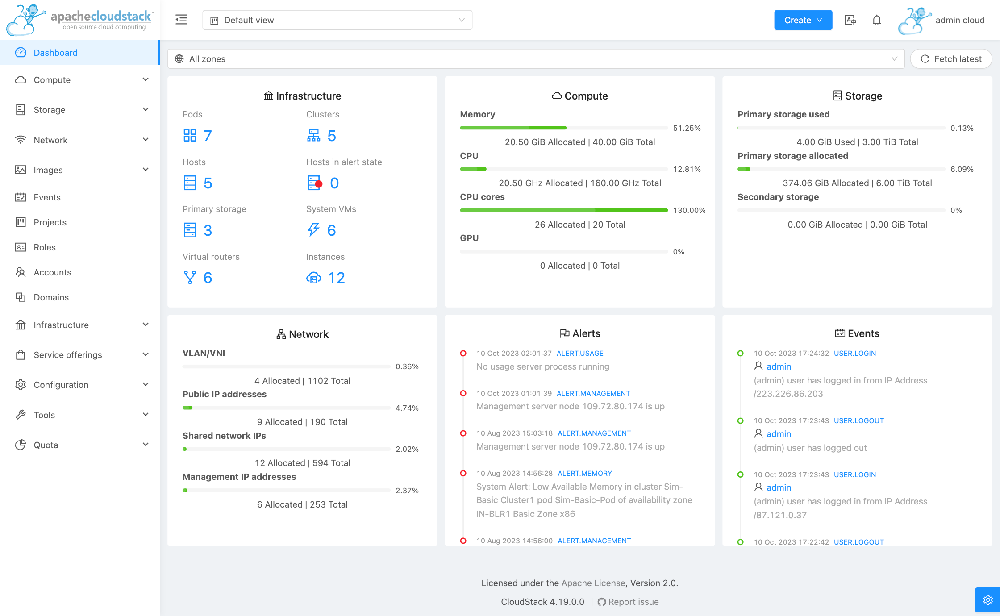

# Apache CloudStack      

Apache CloudStack is the open stack source software designed to deploy and manage large
networks of virtual machines, as a highly available, highly scalable
Infrastructure as a Service (IaaS) cloud computing platform. CloudStack is used
by a number of service providers to offer public cloud services, and by many
companies to provide an on-premises (private) cloud offering, or as part of a
hybrid cloud solution.

CloudStack is a turnkey solution that includes the entire "stack" of features
most organizations want with an IaaS cloud: compute orchestration,
Network-as-a-Service, user and account management, a full and open native API,
resource accounting, and a first-class User Interface (UI).

CloudStack currently supports the most popular hypervisors:
VMware vSphere, KVM, XenServer, XenProject and Hyper-V as well as
OVM and LXC containers.

Users can manage their cloud with an easy to use Web interface, command line
tools, and/or a full-featured query based API.

For more information on Apache CloudStack, please visit the [website](http://cloudstack.apache.org)

## Who Uses CloudStack?

* There are more than 150 known organizations using Apache CloudStack (or a commercial distribution of CloudStack). Our users include many major service providers running CloudStack to offer public cloud services, product vendors who incorporate or integrate with CloudStack in their own products, organizations who have used CloudStack to build their own private clouds, and systems integrators that offer CloudStack related services.

* See our [case studies](https://cwiki.apache.org/confluence/display/CLOUDSTACK/Case+Studies) highlighting successful deployments of Apache CloudStack.

* See the up-to-date list of current [users](https://cloudstack.apache.org/users.html).

* If you are using CloudStack in your organization and your company is not listed above, please complete our brief adoption [survey](https://cloudstack.apache.org/survey.html). We're happy to keep your company name anonymous if you require.

## Demo

See the project user-interface QA website that runs CloudStack against simulator hypervisor:
https://qa.cloudstack.cloud/simulator/ (admin:password)

## Getting Started

* Download a released [version](https://cloudstack.apache.org/downloads.html)
* Build from source with the instructions in the [INSTALL.md](INSTALL.md) file.

## Getting Source Repository

Apache CloudStack project uses Git. The official Git repository is at:

    https://gitbox.apache.org/repos/asf/cloudstack.git

And a mirror is hosted on GitHub:

    https://github.com/apache/cloudstack

The GitHub mirror is strictly read only and provides convenience to users and
developers to explore the code and for the community to accept contributions
via GitHub pull requests.

## Documentation

* [Project Documentation](https://docs.cloudstack.apache.org)
* [Release notes](https://docs.cloudstack.apache.org/projects/cloudstack-release-notes)
* Developer [wiki](https://cwiki.apache.org/confluence/display/CLOUDSTACK/Home)
* Design [documents](https://cwiki.apache.org/confluence/display/CLOUDSTACK/Design)
* API [documentation](https://cloudstack.apache.org/api.html)
* How to [contribute](CONTRIBUTING.md)

## News and Events

* [Blog](https://blogs.apache.org/cloudstack)
* [Twitter](https://twitter.com/cloudstack)
* [Events and meetup](http://cloudstackcollab.org/)
* [YouTube channel](https://www.youtube.com/ApacheCloudStack)

## Getting Involved and Contributing

Interested in helping out with Apache CloudStack? Great! We welcome
participation from anybody willing to work [The Apache Way](http://theapacheway.com) and make a
contribution. Note that you do not have to be a developer in order to contribute
to Apache CloudStack. We need folks to help with documentation, translation,
promotion etc. See our contribution [page](http://cloudstack.apache.org/contribute.html).

If you're interested in learning more or participating in the Apache CloudStack
project, the mailing lists are the best way to do that. While the project has
several communications channels, the [mailing lists](http://cloudstack.apache.org/mailing-lists.html) are the most active and the
official channels for making decisions about the project itself.

Mailing lists:
- [Development Mailing List](mailto:dev-subscribe@cloudstack.apache.org)
- [Users Mailing List](mailto:users-subscribe@cloudstack.apache.org)
- [Commits Mailing List](mailto:commits-subscribe@cloudstack.apache.org)
- [Issues Mailing List](mailto:issues-subscribe@cloudstack.apache.org)
- [Marketing Mailing List](mailto:marketing-subscribe@cloudstack.apache.org)

Report and/or check bugs on [GitHub](https://github.com/apache/cloudstack/issues) and check our
developer [page](https://cloudstack.apache.org/developers.html) for contributing code.

## Reporting Security Vulnerabilities

If you've found an issue that you believe is a security vulnerability in a
released version of CloudStack, please report it to `security@apache.org` with
details about the vulnerability, how it might be exploited, and any additional
information that might be useful.

For more details, please visit our security [page](http://cloudstack.apache.org/security.html).

## License

Licensed to the Apache Software Foundation (ASF) under one
or more contributor license agreements.  See the NOTICE file
distributed with this work for additional information
regarding copyright ownership.  The ASF licenses this file
to you under the Apache License, Version 2.0 (the
"License"); you may not use this file except in compliance
with the License.  You may obtain a copy of the License at

  http://www.apache.org/licenses/LICENSE-2.0

Unless required by applicable law or agreed to in writing,
software distributed under the License is distributed on an
"AS IS" BASIS, WITHOUT WARRANTIES OR CONDITIONS OF ANY
KIND, either express or implied.  See the License for the
specific language governing permissions and limitations
under the License.

Please see the [LICENSE](LICENSE) file included in the root directory
of the source tree for extended license details.

## Notice of Cryptographic Software

This distribution includes cryptographic software. The country in which you currently
reside may have restrictions on the import, possession, use, and/or re-export to another
country, of encryption software. BEFORE using any encryption software, please check your
country's laws, regulations and policies concerning the import, possession, or use, and
re-export of encryption software, to see if this is permitted. See http://www.wassenaar.org/
for more information.

The U.S. Government Department of Commerce, Bureau of Industry and Security (BIS), has
classified this software as Export Commodity Control Number (ECCN) 5D002.C.1, which
includes information security software using or performing cryptographic functions with
asymmetric algorithms. The form and manner of this Apache Software Foundation distribution
makes it eligible for export under the License Exception ENC Technology Software
Unrestricted (TSU) exception (see the BIS Export Administration Regulations, Section
740.13) for both object code and source code.

The following provides more details on the included cryptographic software:

* CloudStack makes use of JaSypt cryptographic libraries.
* CloudStack has a system requirement of MySQL, and uses native database encryption functionality.
* CloudStack makes use of the Bouncy Castle general-purpose encryption library.
* CloudStack can optionally interact with and control OpenSwan-based VPNs.
* CloudStack has a dependency on and makes use of JSch - a java SSH2 implementation.
